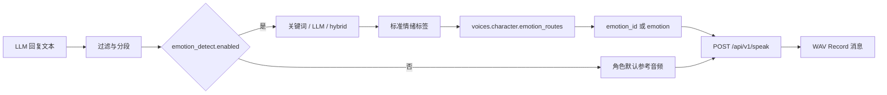

# AstrBot Genie-TTS 插件使用与设计说明

> 适用版本：插件 `v2.4.1+`，Gateway API 使用 `/api/v1/*`。
>
> 本插件的目标是：**只手动填写 Gateway 地址和 API Key，其余模型、默认角色、默认情绪、参考音频和情绪路由均从 Gateway 自动获取。**

## 1. 总览

插件位于 AstrBot 与 Genie TTS Gateway 之间：

```text
AstrBot 的 LLM 文本
  -> 文本清洗 / 分段
  -> 情绪识别（关键词、AstrBot LLM 或独立 OpenAI 兼容 LLM）
  -> emotion_routes 映射为 Gateway 参考音频 ID
  -> POST /api/v1/speak
  -> WAV 临时文件
  -> AstrBot Record 消息
```

启动后，插件会使用配置的 `base_url` 和 `api_key` 调用：

- `GET /api/v1/me`：校验 Key。
- `GET /api/v1/characters`：获取角色、默认角色、参考音频和基础情绪信息。
- `GET /api/v1/emotions`：补全每个角色的情绪/参考音频列表。
- `GET /api/v1/public-status`：读取模型休眠、加载和预热状态。

获取成功后，插件会把目录结果保存到 `voices`，并在 `character=auto` 时选择 Gateway 标记为 `is_default=true` 的角色。

## 2. `emotion_routes` 是什么？

`emotion_routes` 是**插件内部的情绪翻译表**，不是服务器端的情绪识别开关。

LLM 或关键词识别输出的是标准语义标签，例如：`开心`、`悲伤`、`生气`、`兴奋`、`平静`。但 Gateway 中实际可用的是某个角色的参考音频，例如 `标准`、`原始参考音频` 或用户上传的自定义参考音频，并由 `id` 标识。

`emotion_routes` 将两者连接起来：

```json
{
  "label": "开心",
  "aliases": "开心,高兴,快乐,愉快,欢快",
  "emotion_id": 4,
  "emotion": "标准"
}
```

字段含义：

| 字段 | 作用 |
|---|---|
| `label` | 插件情绪检测阶段使用的标准标签。 |
| `aliases` | 用户命令或 LLM 返回的同义词；用于模糊匹配。 |
| `emotion_id` | Gateway 参考音频/情绪的真实 ID；优先随 `/api/v1/speak` 发送。 |
| `emotion` | Gateway 参考音频的名称；当没有可用 ID 时作为后备。 |

### 自动生成规则

1. 插件从 Gateway 获得角色的参考音频列表。
2. Gateway 中存在明确同名情绪时优先匹配，例如“开心”匹配“开心”。
3. 没有同名情绪时，标准标签会回退到该角色的默认参考音频。
4. 每个角色一定会生成一条 `默认` 路由，指向 Gateway 默认参考音频。
5. 同时附加 Gateway 的原始情绪名，方便精确选择。

因此，只有在“同一个角色有多个相近音色、且希望不同语义固定使用不同参考音频”时，才需要人工调整 `emotion_routes`。通常不应手填，也不需要预先知道 ID。

## 3. 情绪数据流



- `keyword`：只使用内置关键词，速度快，不依赖 LLM。
- `llm`：只使用 AstrBot provider 或独立兼容 LLM，理解语境更好。
- `hybrid`：关键词置信度足够时直接使用；否则请求 LLM。推荐。
- `smooth=true`：同一会话会保持近期情绪趋势，避免每句频繁切换参考音频。
- 识别失败或没有匹配路由时，使用 `fallback_label`，最终回退到角色默认参考音频。

## 4. 推荐配置

配置文件：`core/data/config/astrbot_plugin_genie_tts_config.json`。

### 必填项

```json
{
  "base_url": "https://your-tts.example.com",
  "api_key": "<Gateway API Key>"
}
```

当前公网 Gateway 若仍使用 HTTP，也可以工作；但 API Key 和待合成文本会明文传输，应尽快迁移 HTTPS。

### 配置分组

| 分组 | 需要手动填写的内容 | 自动行为 |
|---|---|---|
| 基础配置 | 是否保存服务端音频、超时、重试 | `character=auto` 自动选择 Gateway 默认角色；`language=auto` 从默认参考音频读取语言。 |
| 自动模型 | 通常保持 `auto_sync_voices=true` | 读取角色、参考音频、情绪、默认值，写入 `voices`。 |
| 情绪感知 | 启用、模式、阈值、可选 LLM 配置 | 将结果映射为当前角色的 Gateway 情绪 ID。 |
| 文本处理 | 代码/链接/表情过滤、替换词、静音裁剪 | 合成前清洗 LLM 文本。 |
| 分段发送 | 分段数量、速度、是否同时发文字 | 同一开关控制插件分段与 Gateway 内部断句。 |
| 触发策略 | 全局开关、概率、长度上限、冷却 | 决定哪些回复自动转换语音。 |
| 预热 | 是否预热、提示、状态缓存 | 模型休眠时先唤醒，预热期间以文本回退。 |

### 最小推荐示例

```json
{
  "config_section": "基础配置",
  "base_url": "https://your-tts.example.com",
  "api_key": "<Gateway API Key>",
  "basic": {
    "character": "auto",
    "language": "auto",
    "save_on_server": false,
    "timeout": 300,
    "retry_attempts": 3,
    "auto_check_on_start": true
  },
  "model_select": {
    "auto_sync_voices": true,
    "overwrite_on_sync": false
  },
  "emotion_detect": {
    "enabled": true,
    "mode": "hybrid",
    "smooth": true
  },
  "trigger": {
    "global_enable": true,
    "prob": 1.0,
    "text_limit": 300,
    "cooldown": 0
  }
}
```

## 5. 自动同步与手动覆盖

### 自动同步

- 插件启动并认证成功后，自动请求角色和情绪目录。
- `auto_sync_voices=true` 时，只会添加新角色，保留现有手工路由。
- Gateway 增加角色或上传参考音频后，重载插件即可自动补齐新角色。
- `gentts sync` 也会立即同步。

### 强制重建

使用 `gentts sync force` 或启用 `overwrite_on_sync=true` 会按 Gateway 当前目录重建所有 `voices`。这会覆盖手工编辑的 `emotion_routes`，仅在确认目录数据正确时使用。

### 手动覆盖的正确场景

- 对“开心”与“兴奋”指定不同的自定义参考音频。
- Gateway 的参考音频备注名无法表达真实用途。
- 希望某个标准情绪始终使用默认音色而非 Gateway 名称相近的音色。

优先使用命令测试路由，再修改少量 `emotion_routes`；不要直接手填未知的 `emotion_id`。

## 6. 指令参考

| 指令 | 用途 |
|---|---|
| `gentts help` | 查看简要帮助。 |
| `gentts status` | 查看网关状态、当前角色、情绪、分段和预热状态。 |
| `genietest` | 管理员全面测试：网关、Key、角色目录、LLM 情绪识别和路由。 |
| `gentts sync` | 从 Gateway 补齐新角色与情绪模板。 |
| `gentts sync force` | 按 Gateway 目录强制重建音色模板。 |
| `gentts voices [角色]` | 查看当前自动生成或自定义后的音色路由。 |
| `gentts characters` | 列出 Gateway 角色。 |
| `gentts emotions [角色]` | 列出该角色可用的参考音频/情绪。 |
| `gentts use <角色> [情绪]` | 为当前会话选择角色和可选情绪。 |
| `gentts set character <角色>` | 为当前会话设置角色。 |
| `gentts set emotion <名称或ID>` | 为当前会话设置情绪。 |
| `gentts set global_character <角色>` | 管理员设置全局角色，关闭 `auto`。 |
| `gentts set global_language <zh/en/hybrid>` | 管理员设置全局语言，关闭 `auto`。 |
| `gentts on` / `gentts off` | 为当前会话启用/禁用自动 TTS。 |
| `gentts globalon` / `gentts globaloff` | 管理员切换全局自动播报策略。 |
| `gentts wake` / `gentts sleep` / `gentts unload` | 管理员管理模型预热、休眠和卸载。 |

## 7. 分段、预热与存储

### 分段

插件先清洗文本，再根据句末标点切成完整句子；旧版 `max_segments` 不再限制或合并句子：

- 前面的片段直接发送，最后一段交回 AstrBot 原回复链。
- 一个情绪标签会应用到同一回复的所有句子，避免同一句话中音色跳变。
- 每个句子只发起一次 `/api/v1/speak`，请求按顺序等待完成，不会并列生成多句音频。
- `split.enabled` 开启后由插件负责完整句切分，并强制 Gateway 不再二次断句，避免一句被再次拆分。
- `send_text_with_audio=true` 时，每段会同时发送音频和已清洗文本。

### 预热

Gateway 模型处于休眠或未加载时：

1. 插件请求 `/api/v1/wake`。
2. 后台使用短文本预热模型。
3. 预热期间自动回复先以文本发送。
4. 模型准备完成后，后续回复恢复 TTS。

### 存储

- 插件生成的临时 WAV 保存在插件 `temp_audio`，约 30 秒后删除。
- `save_on_server=true` 时，Gateway 还会保存生成记录与音频；这适合审计，不适合敏感聊天。
- 对普通机器人对话建议使用 `save_on_server=false`。

## 8. 迁移说明

旧版配置中的 `gateway`、`simple_settings`、`text_process`、顶层角色/情绪字段以及基础配置中的触发字段仍能被读取一次，用于兼容已有安装。

插件下一次持久化配置时会写入新的统一分组：

- 角色/语言：`basic`
- 角色目录和路由：`voices`、`model_select`
- 自动触发：`trigger`
- 文本处理：`filter`
- 分段和文本回传：`split`

旧的重复字段不会再写回。

## 9. 故障排查

### 没有自动语音

1. 执行 `gentts status`，确认全局和会话均启用。
2. 检查 `trigger.prob` 是否为 `1.0`，`text_limit` 是否足够大，`cooldown` 是否为 `0`。
3. 执行 `genietest`，检查 `/api/v1/me`、角色目录和情绪链路。
4. 确认插件已经重载到包含 `on_decorating_result` 回调的最新版本。

### 情绪没有变化

1. 执行 `gentts emotions <角色>`，确认 Gateway 有多个参考音频。
2. 执行 `gentts voices <角色>`，确认路由指向不同 `emotion_id`。
3. `gentts sync force` 重建目录后再检查。
4. 将 `emotion_detect.mode` 设为 `hybrid` 或 `llm`，并确认 LLM provider 可用。

### 角色或参考音频新增后未出现

1. 确认 Gateway 管理端已经启用该模型或参考音频。
2. 执行 `gentts sync`。
3. 仍未出现时执行 `gentts sync force`。
4. 查看 Gateway `/api/v1/characters` 和 `/api/v1/emotions` 的返回内容。

### 首句很慢

这是模型休眠后的预热过程。可以手动执行 `gentts wake`，或保持 `warmup.enabled=true`；不要通过无限延长模型常驻时间来解决，应该在内存占用和首句延迟之间取舍。

## 10. 安全建议

- 公网部署必须使用 HTTPS；不要通过明文 HTTP 传递 `X-API-Key` 和聊天文本。
- 不要在群聊或日志中发送 API Key。
- Gateway 的 `save_on_server` 记录包含文本和音频，应按隐私策略清理。
- 管理员 API Key 仅用于 `/api/admin/*` 和 `/api/control/*`，日常 AstrBot 插件建议使用非管理员 Key。

## 11. 致谢

- TTS 情绪路由参考：[muyouzhi6/astrbot_plugin_tts_emotion_router](https://github.com/muyouzhi6/astrbot_plugin_tts_emotion_router)
- 分段过滤参考：[nuomicici/astrbot_plugin_splitter](https://github.com/nuomicici/astrbot_plugin_splitter)